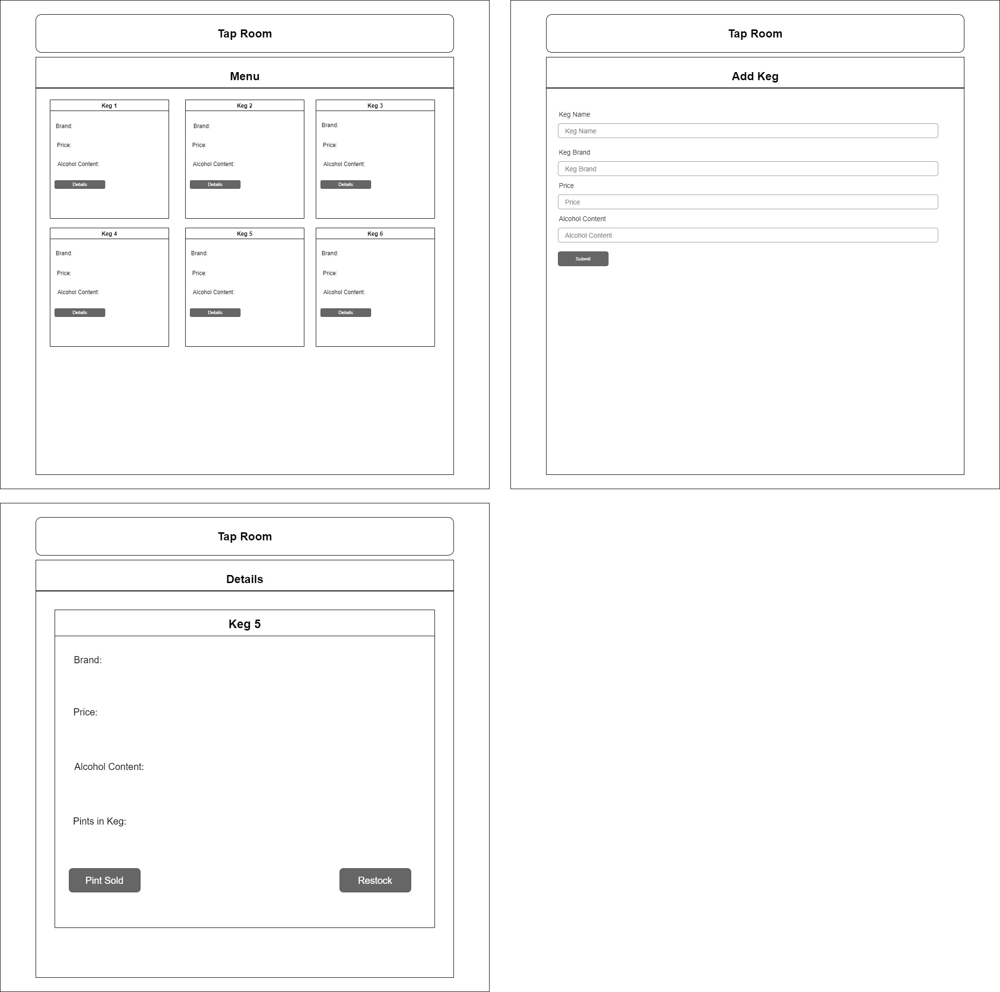

# Tap Room

This is a site for a tap room to keep inventory of their kegs.

## Created By

Diego Serafico

## Technologies Used

* React
* JavaScript
* Node Package Manager
* Webpack

## Description

This is a website for a tap room to manage stock of their kegs. They can see a list of their kegs including their information like name, brand, and price. They can also add a keg by filling out the form and submitting it, they will see it added to the list on the menu. 

## Diagram

### Setup/Installation

* Clone this repository
* Open the teminal and type 'cd tap-room'
* Type 'npm start' on the terminal. A localhost:3000 link will open in you browser. If not type it in manualy or click the link in the terminal.

## Known bugs

* N/A

## License 

MIT[https://opensource.org/licenses/MIT] 2021

## Contact Info
